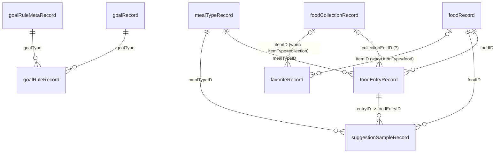

## Technical Details Spike Results

### Location

- Primary DB: `~/Library/Containers/com.algebraiclabs.foodnoms/Data/Documents/db.db`
- Secondary DB: `~/Library/Containers/com.algebraiclabs.foodnoms/Data/Documents/logistics.db` (auxiliary)

### Timezone Note

`foodEntryRecord.date` appears stored in UTC. Convert to local Central time with:

```sql
SELECT datetime(date, 'localtime') FROM foodEntryRecord;
```

### Core Tables (Most Important)

- `foodEntryRecord`: per-log food entries (name, date, quantity, calories, nutrients JSON, mealTypeID, foodID)
- `foodRecord`: food catalog/master records (base nutrients, source, barcode, brand)
- `mealTypeRecord`: meal bucket metadata (mealTypeID, name, time ranges)

### Other Data Tables and Likely Purpose

- `activityEntryRecord`: activity logs by day (likely exercise / activity-related values)
- `foodCollectionRecord`: saved recipes/meals/collections (`foodEntries` blob)
- `favoriteRecord`: favorites and quick items
- `goalRecord`: configured goals
- `goalRuleRecord`: goal rules / adjustments / bounds
- `goalRuleMetaRecord`: goal rule metadata
- `suggestionSampleRecord`: suggestion/recommendation samples from entry history
- `scanRecord`: barcode scan history
- `deletedRecords`: sync tombstones for deleted records
- `cloudKitServerChangeTokenRecord`: CloudKit sync checkpoint
- `supabaseChangeTokenRecord`: Supabase sync checkpoint
- `syncMarkerRecord`: sync marker state
- `healthKitQueryAnchorRecord`: HealthKit anchor state
- `grdb_migrations`: migration history (GRDB)
- `sqlite_sequence`: SQLite internal autoincrement state

### FTS / Search Index Tables (Internal)

These are internal full-text-search structures backing app search:

- `foodSearch`, `foodSearch_docsize`, `foodSearch_segdir`, `foodSearch_segments`, `foodSearch_stat`
- `foodEntrySearch`, `foodEntrySearch_docsize`, `foodEntrySearch_segdir`, `foodEntrySearch_segments`, `foodEntrySearch_stat`
- `foodCollectionSearch`, `foodCollectionSearch_docsize`, `foodCollectionSearch_segdir`, `foodCollectionSearch_segments`, `foodCollectionSearch_stat`

### Row Counts (Snapshot)

| Table                           |  Rows |
| ------------------------------- | ----: |
| activityEntryRecord             |  2187 |
| cloudKitServerChangeTokenRecord |     1 |
| deletedRecords                  | 19103 |
| favoriteRecord                  |    13 |
| foodCollectionRecord            |    15 |
| foodEntryRecord                 |  2959 |
| foodRecord                      |    38 |
| goalRecord                      |     5 |
| goalRuleMetaRecord              |     5 |
| goalRuleRecord                  |    14 |
| grdb_migrations                 |    36 |
| healthKitQueryAnchorRecord      |     0 |
| mealTypeRecord                  |     6 |
| scanRecord                      |     0 |
| suggestionSampleRecord          |  2882 |
| supabaseChangeTokenRecord       |     0 |
| syncMarkerRecord                |     0 |

### Inferred Relationships

- `foodEntryRecord.foodID` -> `foodRecord.foodID`
- `foodEntryRecord.mealTypeID` -> `mealTypeRecord.mealTypeID`
- `foodEntryRecord.collectionEditID` appears to relate to collection/grouping in `foodCollectionRecord` (inferred)
- `suggestionSampleRecord.foodEntryID` -> `foodEntryRecord.entryID` (inferred)
- `suggestionSampleRecord.foodID` -> `foodRecord.foodID`
- `goalRuleRecord.goalType` ties to both `goalRecord.goalType` and `goalRuleMetaRecord.goalType`
- `favoriteRecord.itemID` likely references either food or collection depending on `itemType` (inferred)

### Mermaid ER Diagram (Inferred)



### Practical Query Snippets

Today in local time:

```sql
SELECT datetime(date, 'localtime') AS local_dt, name, calories
FROM foodEntryRecord
WHERE date(datetime(date, 'localtime')) = date('now', 'localtime')
ORDER BY local_dt;
```

Exact query used for today's entries + macros (scaled, with NULL/zero guards):

```sql
WITH entries AS (
  SELECT
    datetime(date,'localtime') AS local_dt,
    name,
    ROUND(calories,1) AS calories,
    json_extract(nutrients,'$.calories') AS base_calories,
    json_extract(nutrients,'$.protein') AS base_protein,
    json_extract(nutrients,'$.carbs') AS base_carbs,
    json_extract(nutrients,'$.fat') AS base_fat
  FROM foodEntryRecord
  WHERE date(datetime(date,'localtime')) = date('now','localtime')
)
SELECT
  local_dt,
  name,
  calories,
  ROUND(
    CASE
      WHEN base_calories IS NOT NULL AND base_calories > 0
      THEN COALESCE(base_protein,0) * (calories / base_calories)
      ELSE 0
    END, 1
  ) AS protein_g,
  ROUND(
    CASE
      WHEN base_calories IS NOT NULL AND base_calories > 0
      THEN COALESCE(base_carbs,0) * (calories / base_calories)
      ELSE 0
    END, 1
  ) AS carbs_g,
  ROUND(
    CASE
      WHEN base_calories IS NOT NULL AND base_calories > 0
      THEN COALESCE(base_fat,0) * (calories / base_calories)
      ELSE 0
    END, 1
  ) AS fat_g
FROM entries
ORDER BY local_dt;
```

Alternative shorter version:

```sql
SELECT
  datetime(date, 'localtime') AS local_dt,
  name,
  calories,
  ROUND(json_extract(nutrients,'$.protein') * (calories / json_extract(nutrients,'$.calories')), 1) AS protein_g,
  ROUND(json_extract(nutrients,'$.carbs')   * (calories / json_extract(nutrients,'$.calories')), 1) AS carbs_g,
  ROUND(json_extract(nutrients,'$.fat')     * (calories / json_extract(nutrients,'$.calories')), 1) AS fat_g
FROM foodEntryRecord
WHERE date(datetime(date,'localtime')) = date('now','localtime')
ORDER BY local_dt;
```
