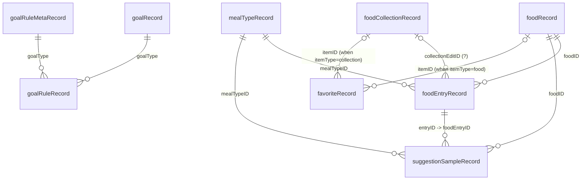

## Technical Details Spike Results

### Location

- Primary DB: `~/Library/Containers/com.algebraiclabs.foodnoms/Data/Documents/db.db`
- Secondary DB: `~/Library/Containers/com.algebraiclabs.foodnoms/Data/Documents/logistics.db` (auxiliary)

### Timezone Note

`foodEntryRecord.date` appears stored in UTC. Convert to local Central time with:

```sql
SELECT datetime(date, 'localtime') FROM foodEntryRecord;
```

### Snapshot and Migration Evidence

This reference was refreshed from the read-only `foodnoms-calibrated-energy-2026-07-27T21-43-53-0500/db.db` copy on 2026-07-27, with `foodnoms-pre-update-2026-07-27T11-49-54-0500/db.db` and `foodnoms-post-update-2026-07-27T20-41-36-0500/db.db` used only for before/after schema comparison. It does not record personal profile or body-measurement values.

The calibrated copy has 162 schema objects: 48 table objects, 87 indexes, and 27 triggers. The 48 includes SQLite's `sqlite_sequence`; the other 47 are FoodNoms application/search tables. The three FTS families account for 15 table objects, leaving 33 non-FTS table objects including `sqlite_sequence`, or 32 non-FTS FoodNoms application tables.

The pre-update copy has 33 table objects. The post-update and calibrated copies each have 48, adding `bodyMetricEntryMetaRecord`, `bodyMetricEntryRecord`, `bodyProfileRecord`, `calendarRecoveryJournalRecord`, `energyStrategyRecord`, `foodEntryGroupCollapseStateRecord`, `healthProfileMetaRecord`, `healthProfileRecord`, `initialSyncAttemptRecord`, `macroGoalStrategyMetaRecord`, `macroGoalStrategyRecord`, `migrationMarkerRecord`, `pendingEventRecord`, `weightGoalMetaRecord`, and `weightGoalRecord`.

`goalRuleRecord` grew from 31 to 37 columns. The six observed additions are `relativeFractionalLowerBound`, `relativeFractionalTargetValue`, `relativeFractionalUpperBound`, `targetValue`, `toleranceUnit`, and `toleranceValue`. These are schema facts; their business interpretation comes from the resolver, not from SQLite constraints.

### Core Tables (Most Important)

- `foodEntryRecord`: per-log food entries (name, date, quantity, calories, nutrients JSON, mealTypeID, foodID, and collection-edit component linkage)
- `foodRecord`: food catalog/master records (base nutrients, source, barcode, brand)
- `mealTypeRecord`: meal bucket metadata (mealTypeID, name, time ranges)
- `foodCollectionRecord`: saved recipes/meals/collections. Its `collectionEditID` joins component rows in `foodEntryRecord`; the legacy `foodEntries` blob is null for every collection in the calibrated snapshot and is not a reliable component source.
- `goalRecord`, `goalRuleRecord`, and `goalRuleMetaRecord`: configured goal definitions, date-aware rules, and rule metadata.
- `energyStrategyRecord`, `weightGoalRecord`, and `macroGoalStrategyRecord`: date-aware energy, weight, and macro strategy records added by the migration.
- `bodyMetricEntryRecord` and `bodyProfileRecord`: dated metric entries and profile fields used by the resolver when a strategy requires them.
- `activityEntryRecord`: dated activity values; the resolver reads `restingEnergy` and `activeEnergy` entries.

### Other Data Tables and Likely Purpose

- `favoriteRecord`: favorites and quick items
- `suggestionSampleRecord`: suggestion/recommendation samples from entry history
- `scanRecord`: barcode scan history
- `deletedRecords`: sync tombstones for deleted records
- `cloudKitServerChangeTokenRecord`, `supabaseChangeTokenRecord`, and `syncMarkerRecord`: sync checkpoint/marker state
- `healthKitQueryAnchorRecord`: HealthKit query-anchor state
- `calendarRecoveryJournalRecord`, `foodEntryGroupCollapseStateRecord`, `initialSyncAttemptRecord`, `migrationMarkerRecord`, and `pendingEventRecord`: application workflow state; these purposes are inferred from the table names.
- `bodyMetricEntryMetaRecord`, `healthProfileMetaRecord`, `macroGoalStrategyMetaRecord`, and `weightGoalMetaRecord`: migration-added metadata tables.
- `grdb_migrations`: migration history (GRDB)
- `sqlite_sequence`: SQLite internal autoincrement state

### FTS / Search Index Tables (Internal)

These are internal full-text-search structures backing app search:

- `foodSearch`, `foodSearch_docsize`, `foodSearch_segdir`, `foodSearch_segments`, `foodSearch_stat`
- `foodEntrySearch`, `foodEntrySearch_docsize`, `foodEntrySearch_segdir`, `foodEntrySearch_segments`, `foodEntrySearch_stat`
- `foodCollectionSearch`, `foodCollectionSearch_docsize`, `foodCollectionSearch_segdir`, `foodCollectionSearch_segments`, `foodCollectionSearch_stat`

### Row Counts (Calibrated Snapshot)

The following are counts from the calibrated 2026-07-27 copy, not a live-database claim. `foodCollectionRecord` contains 18 collections: 13 meals (`collectionType = 2`) and 5 recipes (`collectionType = 3`).

| Table | Rows |
| --- | ---: |
| activityEntryRecord | 2476 |
| bodyMetricEntryMetaRecord | 2 |
| bodyMetricEntryRecord | 26 |
| bodyProfileRecord | 1 |
| cloudKitServerChangeTokenRecord | 1 |
| deletedRecords | 27441 |
| energyStrategyRecord | 4 |
| favoriteRecord | 14 |
| foodCollectionRecord | 18 |
| foodEntryRecord | 5175 |
| foodRecord | 45 |
| goalRecord | 7 |
| goalRuleMetaRecord | 7 |
| goalRuleRecord | 29 |
| grdb_migrations | 55 |
| healthKitQueryAnchorRecord | 0 |
| macroGoalStrategyMetaRecord | 1 |
| macroGoalStrategyRecord | 1 |
| mealTypeRecord | 7 |
| migrationMarkerRecord | 5 |
| scanRecord | 0 |
| suggestionSampleRecord | 5054 |
| supabaseChangeTokenRecord | 0 |
| syncMarkerRecord | 0 |
| weightGoalMetaRecord | 1 |
| weightGoalRecord | 2 |

### Inferred Relationships

No foreign-key constraint was used as evidence for the following relationships; they are inferred from matching identifiers and the current query code.

- `foodEntryRecord.foodID` -> `foodRecord.foodID`
- `foodEntryRecord.mealTypeID` -> `mealTypeRecord.mealTypeID`
- `foodEntryRecord.collectionEditID` matches `foodCollectionRecord.collectionEditID` for saved collection components. `collectionSortIndex` orders components and can be null.
- `suggestionSampleRecord.foodEntryID` -> `foodEntryRecord.entryID` (inferred)
- `suggestionSampleRecord.foodID` -> `foodRecord.foodID`
- `goalRuleRecord.goalType` ties to both `goalRecord.goalType` and `goalRuleMetaRecord.goalType`
- `favoriteRecord.itemID` likely references either food or collection depending on `itemType` (inferred)

### Date-Aware Goal Resolver (SnackTrace Behavior)

This section describes the current SnackTrace resolver, rather than a FoodNoms schema guarantee. It resolves an active rule by `startDay`, preferring the newest active matching weekday override over the newest active generic rule, then breaks ties by creation time and row ID. It projects one baked goal for the requested date with exactly `goalId`, `type`, `target`, `lowerBound`, `upperBound`, and `actual`; it does not expose a rule history, mode, status, ratio, or aggregate goal summary. Numeric values are rounded to four decimal places, and bounds are inclusive.

For migrated strategy rows, the resolver uses energy method `2` as a stored-total-energy path via `manualTotalEnergy` and method `1` as an automatic path. The calibrated snapshot has one method-2 row and its `manualTotalEnergy` is populated; the resolver reads that field without exposing its value. The automatic path can use a stored resting value, calculate from effective body metrics/profile data, or, for `restingEnergyCalculationMode = 3`, average a complete preceding seven-day `restingEnergy` activity history and combine it with the requested day's `activeEnergy` when configured. This is the repository's Health-derived energy path; no personal values are documented here. The snapshot's `energyStrategyRecord` also has `calibration*` columns, but the current resolver does not read those fields, so this reference does not claim a distinct calibrated-energy calculation.

When `macroGoalStrategyRecord.mode = 3`, the resolver derives protein, fat, and carbohydrate targets from its unit/value fields, supporting grams, grams per body weight, percentage, and a carbohydrate remainder. It applies that strategy's tolerance to the derived macro bounds. A calorie rule's stored `minimum` is only an automatic-target floor; it is not a separate public field or a guaranteed public lower bound.

### Mermaid ER Diagram (Inferred)


```mermaid
erDiagram
  foodRecord ||--o{ foodEntryRecord : "foodID"
  mealTypeRecord ||--o{ foodEntryRecord : "mealTypeID"
  foodCollectionRecord o|--o{ foodEntryRecord : "collectionEditID (?)"

  foodEntryRecord ||--o{ suggestionSampleRecord : "entryID -> foodEntryID"
  foodRecord ||--o{ suggestionSampleRecord : "foodID"
  mealTypeRecord ||--o{ suggestionSampleRecord : "mealTypeID"

  goalRecord ||--o{ goalRuleRecord : "goalType"
  goalRuleMetaRecord ||--o{ goalRuleRecord : "goalType"

  foodRecord o|--o{ favoriteRecord : "itemID (when itemType=food)"
  foodCollectionRecord o|--o{ favoriteRecord : "itemID (when itemType=collection)"
```

### Practical Query Snippets

Today in local time:

```sql
SELECT datetime(date, 'localtime') AS local_dt, name, calories
FROM foodEntryRecord
WHERE date(datetime(date, 'localtime')) = date('now', 'localtime')
ORDER BY local_dt;
```

Exact query used for today's entries + macros (scaled, with NULL/zero guards):

```sql
WITH entries AS (
  SELECT
    datetime(date,'localtime') AS local_dt,
    name,
    ROUND(calories,1) AS calories,
    json_extract(nutrients,'$.calories') AS base_calories,
    json_extract(nutrients,'$.protein') AS base_protein,
    json_extract(nutrients,'$.carbs') AS base_carbs,
    json_extract(nutrients,'$.fat') AS base_fat
  FROM foodEntryRecord
  WHERE date(datetime(date,'localtime')) = date('now','localtime')
)
SELECT
  local_dt,
  name,
  calories,
  ROUND(
    CASE
      WHEN base_calories IS NOT NULL AND base_calories > 0
      THEN COALESCE(base_protein,0) * (calories / base_calories)
      ELSE 0
    END, 1
  ) AS protein_g,
  ROUND(
    CASE
      WHEN base_calories IS NOT NULL AND base_calories > 0
      THEN COALESCE(base_carbs,0) * (calories / base_calories)
      ELSE 0
    END, 1
  ) AS carbs_g,
  ROUND(
    CASE
      WHEN base_calories IS NOT NULL AND base_calories > 0
      THEN COALESCE(base_fat,0) * (calories / base_calories)
      ELSE 0
    END, 1
  ) AS fat_g
FROM entries
ORDER BY local_dt;
```

Alternative shorter version:

```sql
SELECT
  datetime(date, 'localtime') AS local_dt,
  name,
  calories,
  ROUND(json_extract(nutrients,'$.protein') * (calories / json_extract(nutrients,'$.calories')), 1) AS protein_g,
  ROUND(json_extract(nutrients,'$.carbs')   * (calories / json_extract(nutrients,'$.calories')), 1) AS carbs_g,
  ROUND(json_extract(nutrients,'$.fat')     * (calories / json_extract(nutrients,'$.calories')), 1) AS fat_g
FROM foodEntryRecord
WHERE date(datetime(date,'localtime')) = date('now','localtime')
ORDER BY local_dt;
```
